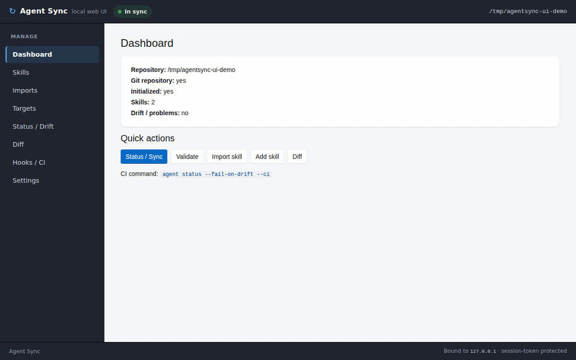

# Agent Sync

[](https://github.com/nova-globen/agent/actions/workflows/agent-sync-check.yml)
[](https://github.com/nova-globen/agent/releases)
[](LICENSE)

Agent Sync is a Git-native consistency manager for AI-agent skills, instructions,
and configuration files. Define a skill once and mirror it into the formats every
AI coding agent expects — keeping `AGENTS.md`, `CLAUDE.md`, Cursor rules, GitHub
Copilot instructions, Gemini instructions, and OpenAI/Claude skill folders in sync.

The core problem it solves is **agent instruction drift**: the same guidance,
duplicated by hand across many files, slowly diverging until the agents disagree.

The CLI is the primary interface; an optional local web UI (`agent ui`) wraps the same
engine for those who prefer a screen:

<p align="center">
  
</p>

<p align="center"><em>The optional local web UI — bound to <code>127.0.0.1</code>, driving the same canonical-skill engine as the CLI.</em></p>

## Status: stable (v0.3.1)

The core workflow — author canonical skills, project them to every target, and catch
drift via Git hooks and CI — is solid end to end and has been tested across real
repositories. `v0.3.1` fixes `agent autopilot claude` on TTY terminals (see [Headless autopilot loop](#headless-autopilot-loop-agent-autopilot-claude)); `v0.3.0` added autopilot and `--with-samples`.

Known gaps (not blockers):

- Needs more real-world testing on Linux and macOS (Windows is the primary validated platform).
- Symlink escape hardening is not yet implemented.
- Package managers (Homebrew, winget, etc.) are not yet available; install via the
  shell script or as a .NET tool on NuGet (`AgentSync` / `AgentSync.Git`).

Feedback and real-world bug reports are welcome — see [Contributing](#contributing)
and the issue templates.

## Who this is for

- Developers using multiple AI coding agents in one repository.
- Teams maintaining `AGENTS.md`, `CLAUDE.md`, Cursor rules, Copilot instructions,
  Gemini instructions, or skill folders.
- Teams that want Git hooks and CI to catch AI-instruction drift automatically.

## What Agent Sync is not

- Not a replacement for Git.
- Not an AI agent runtime.
- Not a prompt optimizer.
- Not a hosted SaaS.
- Not a package registry.

## How it works

You author canonical skills under `.agent/`:

```text
.agent/
  agent.yaml            # which targets are enabled and where they live
  lock.json             # last-known-good hashes for every projection
  skills/
    <skill-id>/
      skill.yaml        # id, name, description, version, enabled targets
      SKILL.md          # the canonical instruction body
```

Agent Sync **projects** each skill into the configured targets:

```text
AGENTS.md                                  # managed section
CLAUDE.md                                  # managed section
.cursor/rules/<skill-id>.mdc               # generated file
.github/copilot-instructions.md            # managed section
.gemini/GEMINI.md                          # managed section
.chatgpt/skills/<skill-id>/SKILL.md        # generated file
.claude/skills/<skill-id>/SKILL.md         # generated file
```

Content written into shared files lives between stable markers and is never allowed
to clobber your hand-written prose:

```md
<!-- agent-sync:start id=<skill-id> target=<target-id> hash=sha256:<hash> -->
...generated content...
<!-- agent-sync:end -->
```

A hand-edited section is detected (its content no longer matches the hash) and is
left untouched unless you pass `--force`.

## Installation

Agent Sync ships two entry points: `agent` and the Git extension `git-agent` (so
`git agent <command>` works). Releases include self-contained builds, so no .NET
runtime is required to run them.

The CLI is the primary, fully supported interface. The optional local web UI is a
**separate download** (see [Optional local web UI](#optional-local-web-ui)); installing
the CLI never pulls in the UI, and the `dotnet tool` packages are CLI-only.

### Recommended: install from GitHub Releases

Linux/macOS:

```bash
curl -fsSL https://raw.githubusercontent.com/nova-globen/agent/master/scripts/install.sh | bash
```

Install a specific version:

```bash
curl -fsSL https://raw.githubusercontent.com/nova-globen/agent/master/scripts/install.sh | bash -s -- v0.3.1
```

By default this installs into `$HOME/.agent-sync/bin`. Override with
`AGENT_SYNC_INSTALL_DIR=/custom/bin`. The script prints how to add the directory to
your `PATH` if needed.

Windows PowerShell:

```powershell
irm https://raw.githubusercontent.com/nova-globen/agent/master/scripts/install.ps1 | iex
```

Prefer to review the script before running it (recommended):

```powershell
irm https://raw.githubusercontent.com/nova-globen/agent/master/scripts/install.ps1 -OutFile install.ps1
# review install.ps1, then:
.\install.ps1            # or: .\install.ps1 -Version v0.3.1
```

Override the Windows install directory with `$env:AGENT_SYNC_INSTALL_DIR`. Installs
into `%USERPROFILE%\.agent-sync\bin` by default.

### Install as a .NET tool

Agent Sync is published on NuGet as a .NET tool, which is the easiest way to pin a
version per repository. Unlike the self-contained GitHub Releases above, this path
requires the **.NET 10 runtime** on the machine.

Two packages are published:

- [`AgentSync`](https://www.nuget.org/packages/AgentSync) — the `agent` command.
- [`AgentSync.Git`](https://www.nuget.org/packages/AgentSync.Git) — the `git-agent`
  command, so `git agent <command>` works.

**Per-repository (recommended): a tool manifest.** One developer adds the dependency
and commits the manifest; everyone else restores it:

```bash
# once per repo, by whoever adds the dependency
dotnet new tool-manifest          # creates .config/dotnet-tools.json
dotnet tool install AgentSync
dotnet tool install AgentSync.Git

# every other developer, after cloning
dotnet tool restore
```

This produces a committed `.config/dotnet-tools.json`:

```json
{
  "version": 1,
  "isRoot": true,
  "tools": {
    "agentsync": { "version": "0.3.1", "commands": ["agent"] },
    "agentsync.git": { "version": "0.3.1", "commands": ["git-agent"] }
  }
}
```

Run a manifest (local) tool through `dotnet`:

```bash
dotnet agent status
dotnet tool run agent -- status   # equivalent
```

> Note: local manifest tools are invoked via `dotnet agent ...`; their shims are not
> placed on `PATH`, so the bare `agent` and `git agent ...` forms are not available
> from a manifest install. For those, use a global install or the GitHub Releases
> binaries.

**Global install.** This puts `agent` and `git-agent` on your `PATH` (via
`~/.dotnet/tools`), so both `agent ...` and `git agent ...` work:

```bash
dotnet tool install --global AgentSync
dotnet tool install --global AgentSync.Git

agent --version
git agent --version
```

### Manual install

1. Go to the [GitHub Releases](https://github.com/nova-globen/agent/releases) page.
2. Download the archive for your OS/architecture, e.g.
   `agent-sync-v0.3.1-linux-x64.tar.gz` (or `...-win-x64.zip` on Windows).
3. Extract it.
4. Put both `agent` and `git-agent` (or `agent.exe` and `git-agent.exe`) on your `PATH`.
5. Verify:

   ```bash
   agent --version
   git agent --version
   ```

Optionally verify the download against `checksums.txt`:

```bash
sha256sum -c checksums.txt
```

### Build from source

Agent Sync currently targets **.NET 10** (`net10.0`).

```bash
git clone https://github.com/nova-globen/agent.git
cd agent
dotnet build --configuration Release
dotnet test
```

The build produces the executables at:

```text
src/AgentSync.Cli/bin/Release/net10.0/agent
src/AgentSync.GitAgent/bin/Release/net10.0/git-agent
```

Put both on your `PATH` to use `agent ...` and `git agent ...`.

## Quick demo

Scaffold a repo, project the starter skills into every target, and wire the hooks.
`agent init` seeds two canonical skills: a `code-review` skill (enabled for all targets)
and `using-agent-sync`, a short guide that teaches AI agents how to work in an Agent Sync
repo (it projects to `.claude/skills/` only, so it never bloats `AGENTS.md`/`CLAUDE.md`).
Answer **y** at the prompt (or pass `--with-samples`) to also install a curated starter
pack of skills, sub-agents, and Git hooks, including `autopilot`, `commit-governor`, and
`plan-governor`.

```bash
mkdir agent-sync-demo
cd agent-sync-demo
git init

agent init                  # or: agent init --with-samples
agent sync
agent status --fail-on-drift --ci
agent install-hooks
```

Now simulate drift by hand-editing a generated section:

```bash
# Edit AGENTS.md inside the generated agent-sync marker section
# (the block between <!-- agent-sync:start ... --> and <!-- agent-sync:end -->).
agent status --fail-on-drift --ci
```

Agent Sync reports a **manually edited projection** and exits non-zero. With the hooks
installed, Git blocks the commit:

```bash
git commit --allow-empty -m "Should fail because of drift"
# pre-commit runs 'agent status --fail-on-drift' and aborts the commit
```

Restore the generated content and you're green again:

```bash
agent sync --force
agent status --fail-on-drift --ci
```

## Commands

```bash
agent init            # scaffold .agent/ and .githooks/ (--with-samples installs starter pack)
agent status          # report state and drift (--json, --fail-on-drift, --ci)
agent sync            # write missing/outdated projections (--check, --write, --force)
agent diff            # show canonical-to-projection differences
agent validate        # validate config and skills
agent import skill    # import an existing SKILL.md / skill folder into .agent/skills
agent import agent    # import an existing instruction file/folder into canonical skills
agent import subagent # import existing .claude/agents/*.md sub-agents into .agent/agents
agent skill           # manage canonical skills: add | edit | delete | list | show
agent target          # manage projection targets: add | edit | delete | list | show
agent subagent        # manage canonical sub-agents: add | edit | delete | list | show
agent sessions        # back up / restore agent session history: backup | restore | list | providers
agent autopilot claude  # run Claude Code headlessly in a loop until all work is done
agent ui              # launch the optional local web UI (auto-installs it on first run)
agent install-hooks   # configure core.hooksPath and make hooks executable
agent doctor          # diagnose Git repo, PATH, hooks, and config

# Every command is also available as: git agent <command>
```

### `agent sync` behavior

`agent sync` **writes by default** — it creates missing projections and updates
out-of-date ones. Two flags change that:

- `agent sync` — writes missing/outdated projections. Generated sections that you have
  hand-edited are detected and left untouched (reported, not overwritten).
- `agent sync --check` — previews changes without writing anything; exits non-zero if
  any projection would change or has been manually edited.
- `agent sync --force` — additionally overwrites manually edited generated projections,
  regenerating them from the canonical source.

`--write` is the explicit form of the default and can be passed for clarity.

### Skill content conventions

- `skill.yaml` owns display metadata: `name`, `description`, `version`.
- `SKILL.md` owns the instruction body only — it should **not** start with a
  `# <skill name>` heading. Each adapter adds one target-appropriate heading derived
  from `name`, so a leading heading that repeats the skill name is dropped from
  generated output to avoid duplicate headings.

### Typical workflow

```bash
agent init            # once per repository
agent install-hooks   # wire .githooks via core.hooksPath
# edit .agent/skills/<id>/SKILL.md ...
agent sync            # mirror the change into every target
agent status          # confirm no drift
```

## Importing existing skills

If you already have a skill folder or a standalone `SKILL.md` (for example under
`.claude/skills/` or `.chatgpt/skills/`), import it into the canonical `.agent/` layout:

```bash
agent import skill .claude/skills/code-review        # a skill folder
agent import skill path/to/SKILL.md                  # a standalone file
agent import skill path/to/SKILL.md --id my-skill --name "My Skill"
agent import skill path/to/SKILL.md --dry-run        # preview; writes nothing
agent import skill path/to/SKILL.md --force          # overwrite an existing canonical skill
```

Import parses any YAML frontmatter, infers `id`/`name`/`description` when possible,
writes `.agent/skills/<id>/skill.yaml` and `SKILL.md`, and validates the result. It
never overwrites an existing canonical skill unless you pass `--force`. After importing,
run `agent sync` to project the skill into your targets. JSON output is available with
`--json`.

If you already have tool-specific instruction files (an `AGENTS.md`, `CLAUDE.md`,
Copilot/Gemini instructions, or Cursor rules) but no `.agent/`, import them into
canonical skills:

```bash
agent import agent AGENTS.md                       # one skill from the whole file
agent import agent AGENTS.md --split sections       # one skill per top-level heading
agent import agent .cursor/rules                    # one skill per .mdc rule
agent import agent .claude/skills                    # delegates to skill import per folder
agent import agent legacy.md --type agents_md        # force the source type
agent import agent AGENTS.md --dry-run               # preview; writes nothing
```

`import agent` reads the source only — it never modifies your original files. Generated
`agent-sync` sections are skipped by default (pass `--include-generated` to include
them). Each imported skill enables the matching target; run `agent sync` afterwards.

## Managing skills

Create, edit, and remove canonical skills without hand-editing `.agent/skills/`:

```bash
agent skill add docs-review --name "Docs Review" --description "Reviews documentation."
agent skill list                       # or: agent skills
agent skill show docs-review           # add --json for machine-readable output
agent skill edit docs-review --description "Reviews docs and examples."
agent skill edit docs-review --body-file path/to/SKILL.md
agent skill edit docs-review --enable cursor --disable gemini
agent skill delete docs-review         # refused if projections exist; preview with --dry-run
agent skill delete docs-review --force # also prunes the skill's lockfile entries
```

Every mutation re-validates the workspace and reminds you to run `agent sync`.
`skill delete` refuses to remove a skill that has already been projected unless you pass
`--force`; generated sections in shared files are left in place for you to clean up or
re-sync.

## Managing targets

Configure which projection targets are enabled and where they live, without editing
`.agent/agent.yaml` by hand:

```bash
agent target list                       # or: agent targets
agent target show cursor                # add --json for machine-readable output
agent target add gemini --path .gemini/GEMINI.md
agent target edit cursor --path .cursor/rules --enabled true
agent target delete gemini              # refused if projections exist; preview with --dry-run
agent target delete gemini --force      # also prunes the target's lockfile entries
```

Target ids must be known adapter ids (`agents_md`, `claude_md`, `cursor`, `copilot`,
`gemini`, `openai_skill`, `claude_skill`) and paths must stay inside the repository.
Edits round-trip `agent.yaml` through the parser, so hand-written comments in that file
are not preserved.

## Managing sub-agents

Sub-agents (delegate agents such as Claude Code's `.claude/agents/*.md`) are managed the
same canonical-once way as skills. Define one under `.agent/agents/<id>/` and project it:

```bash
agent subagent add reviewer \
  --description "Reviews diffs for correctness bugs." \
  --model sonnet --tools "Read, Grep, Glob"
agent subagent list                     # or: agent subagents
agent subagent show reviewer            # add --json for machine-readable output
agent subagent edit reviewer --description "Reviews diffs and tests." --tool Bash
agent subagent edit reviewer --body-file path/to/prompt.md
agent subagent delete reviewer          # refused if projected; --force prunes the lockfile

agent import subagent .claude/agents/reviewer.md   # import an existing sub-agent
agent import subagent .claude/agents               # import a whole folder
```

`agent sync` projects each canonical sub-agent into a Claude Code sub-agent file
(`.claude/agents/<id>.md`) with `name`/`description`/`tools`/`model` frontmatter, and
`agent status` reports it as drift when it is missing, outdated, or manually edited — just
like a skill projection. Sub-agent projections track their own hashes in
`.agent/agents.lock.json`.

## Backing up and restoring agent sessions

`agent sessions` archives an AI agent's conversation history for the current project and
restores it elsewhere — a different machine, OS, or project path. It understands Claude
Code, OpenAI Codex, GitHub Copilot CLI, Gemini CLI, and Cursor.

```bash
agent sessions providers                       # list supported agents
agent sessions list                            # per-agent session counts for this project
agent sessions backup claude                   # -> agent-sessions-claude-<timestamp>.zip
agent sessions backup codex --output codex.zip
agent sessions restore agent-sessions-claude-*.zip            # into the current project
agent sessions restore claude.zip --project /new/path --dry-run
```

The backup archive carries a manifest recording the source environment (OS, path style,
home directory, project path). On restore, Agent Sync relocates the files to wherever the
target agent expects them and **translates absolute paths** — both the storage location and
the paths embedded inside the session files — across environments. A session captured on
WSL at `/mnt/c/Users/you/proj` restores cleanly on Windows as `C:\Users\you\proj` (and
vice-versa), with JSON contents kept valid. Restore never overwrites existing files unless
you pass `--force`, and writes are confined to the agent's own directory under your home.
Copilot, Gemini, and Cursor support is experimental (their on-disk layouts are less stable).

## Sample skill pack (`agent init --with-samples`)

`agent init` prompts interactively on a TTY, or you can pass a flag:

```bash
agent init --with-samples   # install the starter pack without prompting
agent init --no-samples     # skip it without prompting
```

The starter pack installs a curated set of skills, sub-agents, and Git hooks into the
newly scaffolded `.agent/` directory:

**Skills:** `autopilot`, `commit-governor`, `plan-governor`, `memory-curator`, `next-step`,
`operating-guide`, `adr-author`, `agentsync`, `dotnet-inspect`

**Sub-agents:** `planner`, `verifier`, `git-ops-executor`

**Git hooks:** `pre-commit`, `commit-msg`, `pre-push`, `post-checkout`, `post-merge`

These files are customizable starting points. Run `agent sync` after `agent init
--with-samples` to project everything into your targets, then edit the canonical
sources under `.agent/skills/` to suit your project.

## Headless autopilot loop (`agent autopilot claude`)

`agent autopilot claude` drives Claude Code CLI in a continuous headless loop, delegating
to the **autopilot** skill in the repository to work through the planned backlog until all
work is complete or a hard blocker is hit:

```bash
agent autopilot claude            # loop with default 5-second delay between sessions
agent autopilot claude --delay 10 # wait 10 seconds between sessions
```

Each iteration runs:

```bash
claude --dangerously-skip-permissions -p "continue autopilot"
```

When that session ends, `agent autopilot claude` calls Claude again (via stdin) to extract
a structured JSON verdict — `failed`, `done`, `message`, and optionally `retry.afterSeconds`.
The outer loop then:

- **Retries** automatically if the session hit a transient failure (e.g. an API usage-limit
  reset); it waits the number of seconds Claude reported before trying again.
- **Continues** to the next session when the work was partial (the autopilot skill wrote a
  handoff prompt for the next run).
- **Stops cleanly** when `done: true` is returned — either all work is complete or a hard
  blocker was encountered that requires human intervention.

Claude's live output is forwarded to the console as it runs. Press Ctrl+C to cancel cleanly.

The **autopilot skill** (installed by `--with-samples`, or importable manually) contains the
operating contract: it reads the newest `.agent/prompts/autopilot/prompt-*.txt` file to
resume from the last handoff, runs the implement → verify → commit loop, and writes a new
handoff prompt before stopping.

## Optional local web UI

Agent Sync is a CLI first. An optional GUI is a **separate, independent product**: a
local web UI you run on your own machine. The CLI, the Git extension, the Git hooks, CI
usage, the container images, and the `dotnet tool` packages never depend on it or on any
UI assemblies — the CLI still works fully if the UI is not installed. Installing the CLI
(GitHub Releases or `dotnet tool`) **never** installs the UI.

### Installing the optional UI

The easiest path is to just run it — `agent ui` **installs the UI for you on first run**:

```bash
agent ui    # installs agent-sync-ui if needed, then launches it
```

When the UI isn't already present, `agent ui` installs it automatically:

- If a `dotnet` SDK is on your `PATH`, it installs the **`AgentSync.Ui` .NET tool**
  (command `agent-sync-ui`) at the matching version. You can also do this yourself:

  ```bash
  dotnet tool install --global AgentSync.Ui
  ```

- Otherwise (a self-contained CLI with no `dotnet`), it downloads the matching
  self-contained `agent-sync-ui-<version>-<rid>` archive from
  [GitHub Releases](https://github.com/nova-globen/agent/releases) and extracts it into a
  per-version cache under your home directory (`~/.agent-sync/ui/...`).

You can still install it manually if you prefer — download the
`agent-sync-ui-<version>-<rid>` archive for your OS/architecture, extract it, and put
`agent-sync-ui` on your `PATH` (or point `AGENT_SYNC_UI` at the executable). Keep the whole
extracted folder together — the executable ships with its static web assets (`wwwroot` and
a manifest) alongside it.

`agent ui` discovers the `agent-sync-ui` executable, picks a free port, generates a
per-launch session token, launches the host, and waits for it to report ready (a small
unauthenticated `/healthz` endpoint) before continuing. It then opens your default
browser at `http://127.0.0.1:<port>/?token=<token>`. On the first request the host
exchanges that token into an HttpOnly, `SameSite=Strict` cookie and **redirects to the
same path without the token in the URL**, so the token does not linger in your address
bar or history. If the browser cannot be opened (or you pass `--no-open`), the CLI prints
the token URL so you can open it yourself. If the host does not become ready, `agent ui`
reports the failure and exits non-zero. If the UI is not installed and cannot be installed
automatically, it prints install guidance and exits without affecting the CLI.

The UI is a Blazor web app built with Microsoft FluentUI Blazor components. It binds to
**`127.0.0.1`** only (never `0.0.0.0`), uses a random port, and gates every request with
the session token (valid for the lifetime of the UI process). It is a local, single-repo
tool only — it makes no claim to remote/server/team use. The release workflow builds it in
a **separate, optional job** that publishes the `agent-sync-ui-<version>-<rid>` archives
and the `AgentSync.Ui` .NET tool independently of the CLI artifacts — the CLI release and
the CLI `dotnet tool` packages never include it, and a UI build failure never blocks a CLI
release. See `.agent/features/UI_LOCALHOST_BLAZOR.md` and `RELEASE_CHECKLIST.md`.

The screens drive the same services as the CLI through `AgentSync.Ui.Abstractions`
(`AgentSyncApp`) — no repository logic lives in the Razor components. File-writing
operations (add skill, save changes, import, run sync) are explicit, clearly labelled
submit/apply actions that show the result immediately and offer a dry-run/preview where
the underlying command supports one. Destructive or environment-changing operations
(**delete skill**, **delete target**, **force sync**, **install hooks**) require a second
in-page confirmation step before anything is written. Functional screens: **Dashboard**
(state + quick actions), **Skills** (add / edit / enable-disable targets / delete),
**Imports** (import skill and import agent, with dry-run preview), **Targets** (add / edit
/ delete), **Status / Drift** (status, drift, validate, and run-sync / force-sync),
**Diff**, **Hooks / CI** (copyable CI command + confirmed install-hooks), and **Settings**.
A live drift-status pill in the header reflects the repository state on every screen.
Separate GUI release artifacts are built by the `release-ui` job and attached to tagged
GitHub Releases.

## Drift detection

`agent status` detects missing projections, outdated projections, manually edited
generated sections, invalid config, missing lockfile entries, and orphaned lockfile
entries. For CI:

```bash
agent status --fail-on-drift --ci
```

exits non-zero if drift or invalid state exists. During early development you can use
the build directly:

```bash
dotnet run --project src/AgentSync.Cli -- status --fail-on-drift --ci
```

## Exit codes

```text
0 = success
1 = drift detected or validation failed
2 = invalid usage
3 = tool/environment problem
4 = unexpected error
```

## Git hooks

`agent init` writes `.githooks/pre-commit` and `.githooks/pre-push`. With `--with-samples`
it also writes `commit-msg`, `post-checkout`, and `post-merge`. `agent install-hooks`
points Git at them via `core.hooksPath`. If the hooks are installed but `agent` is
missing, commits and pushes fail with:

```text
Agent Sync is required for this repository.
Install it, then retry.
```

## Examples

- [`examples/sample`](examples/sample) — a fully initialized and synced repository.
- [`examples/github-actions`](examples/github-actions) — gate pull requests on
  agent-instruction drift with a **GitHub Actions** workflow; includes `conventional-commit`
  and `code-review` skills.
- [`examples/azure-pipelines`](examples/azure-pipelines) — the same drift gate as an
  **Azure Pipelines** definition.

## Repository layout

```text
.agent/                      # this repo runs Agent Sync on itself
  agent.yaml                 #   enabled targets
  lock.json                  #   projection hashes
  skills/                    #   canonical skills, projected into AGENTS.md/CLAUDE.md/etc.
  *.md, features/, prompts/  #   project specs & planning docs
src/
  AgentSync.Cli/             # the 'agent' CLI
  AgentSync.GitAgent/        # the 'git-agent' extension (delegates to the CLI)
  AgentSync.Core/            # config, skills, projections, adapters, drift, UI launch/install
  AgentSync.Ui.Abstractions/ # UI-independent application service over Core
  AgentSync.Ui.Web/          # optional localhost Blazor web UI ('agent-sync-ui')
tests/
  AgentSync.Core.Tests/
  AgentSync.Cli.Tests/
  AgentSync.Ui.Abstractions.Tests/
  AgentSync.Ui.Web.Tests/
```

Agent Sync **manages its own agent instructions**: `AGENTS.md`, `CLAUDE.md`,
`.github/copilot-instructions.md`, `.gemini/GEMINI.md`, and the `.claude/skills/` folders
are generated from the canonical skills under `.agent/skills/`, and CI fails the build if
any of them drifts. Edit the skill and run `agent sync` — never hand-edit a generated
section.

The CLI/Core/Git stack never references the UI projects; the headless tooling builds and
ships without any web-UI dependency.

## Contributing

See [CONTRIBUTING.md](CONTRIBUTING.md). By participating you agree to the
[Code of Conduct](CODE_OF_CONDUCT.md). Security reports: see [SECURITY.md](SECURITY.md).
Maintainers cutting a release: see [RELEASE_CHECKLIST.md](RELEASE_CHECKLIST.md).

**AI-agent maintainers:** for project context and guardrails, start with
[CLAUDE.md](CLAUDE.md), [AGENTS.md](AGENTS.md), and
[.agent/CURRENT_STATE.md](.agent/CURRENT_STATE.md).

## License

Agent Sync is licensed under the **GNU Affero General Public License v3.0 or later**
(AGPL-3.0-or-later). See [LICENSE](LICENSE).
